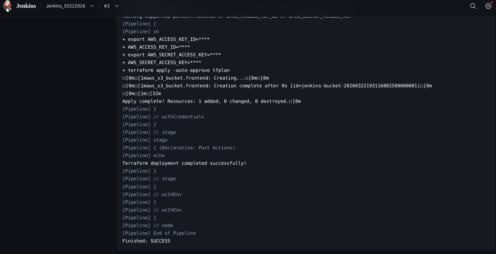
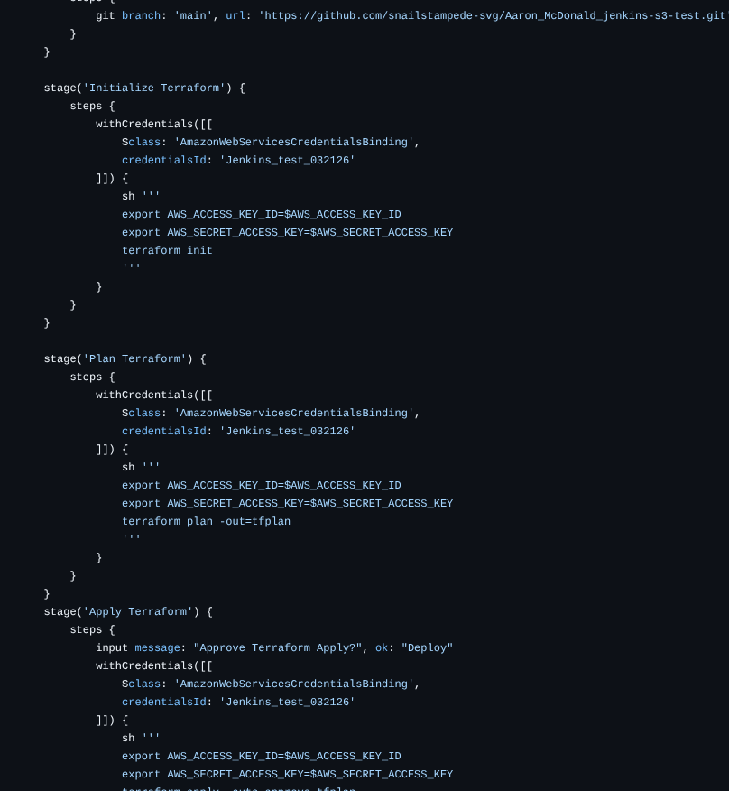
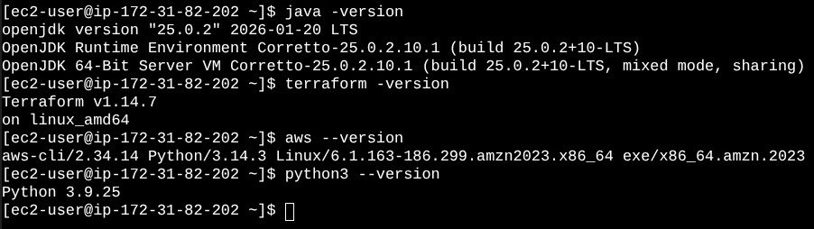
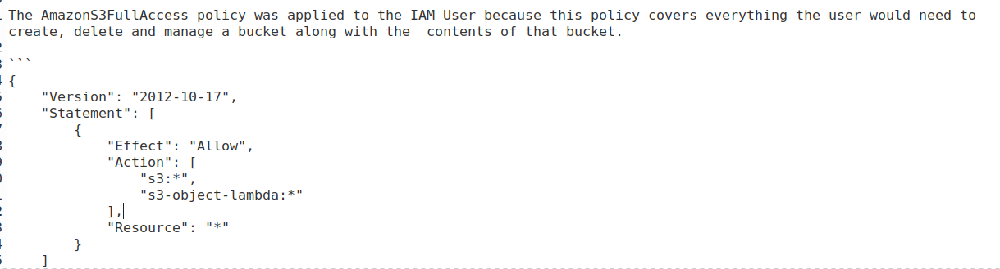
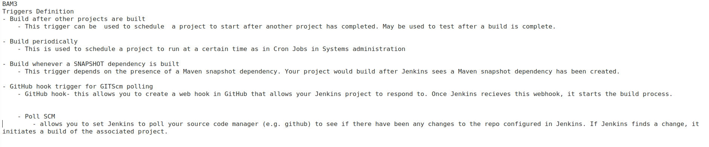

# Week 28 Assignment

__* Successfully deploy a jenkins pipeline build using a GitHub repo in your account. Jenkinsfile must have the terraform validate, format, and destroy stages added. Show screenshots of both the successful build and the Jenkinsfile with the additional stages.*__

__* Modify the startup script to include terraform, AWS, and Python, update the java version used to either Java 21 or 25, and upload a screenshot of all 4 versions (terraform, AWS, Python, Java) after connecting to the server's/container's command line. show evidence via screenshots.*__

